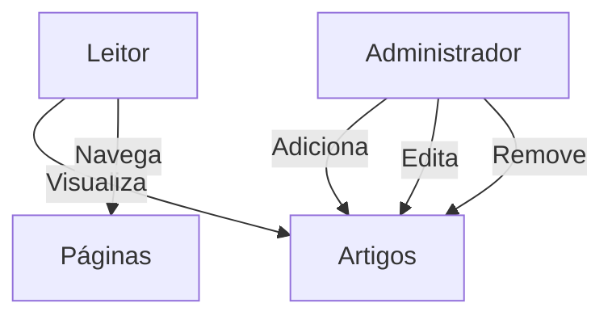

## 📰 Angular Blog

##Este é um projeto de blog desenvolvido com Angular, baseado em um layout moderno inspirado no Dribbble. Projeto desenvolvido para o Bootcamp DecolaTech da Avanade 2025, em parceria com Dio.

---

## 🚀 Funcionalidades

- 📄 Visualização de artigos
- 🔁 Navegação entre páginas
- 🧩 Componentes reutilizáveis
- 🎨 Layout moderno e responsivo

---

## 🛠️ Tecnologias Utilizadas

- Angular 14.1.0
- TypeScript
- HTML5
- CSS3

---

## 🗃️ Estrutura de Pastas

```
angular-blog/
├── src/
│   ├── app/
│   │   ├── components/
│   │   │   └── menu-bar/
│   │   ├── data/
│   │   └── pages/
│   │       ├── home/
│   │       └── content/
│   └── assets/
└── ...
```

---

## 📥 Como Executar o Projeto

### 🔧 Pré-requisitos

- [Node.js](https://nodejs.org/) (versão 14 ou superior)
- Angular CLI instalado globalmente:
  ```bash
  npm install -g @angular/cli
  ```

### ▶️ Passos para execução

1. Clone este repositório:
   ```bash
   git clone https://github.com/felipeAguiarCode/angular-blog.git
   ```

2. Acesse o diretório do projeto:
   ```bash
   cd angular-blog
   ```

3. Instale as dependências:
   ```bash
   npm install
   ```

4. Inicie o servidor de desenvolvimento:
   ```bash
   ng serve
   ```

5. Acesse no navegador:
   ```
   http://localhost:4200
   ```

---

## 🎯 Diagrama de Casos de Uso



---

## 🤝 Contribuições

Contribuições são bem-vindas!  
Você pode abrir uma *issue* com sugestões ou enviar um *pull request* com melhorias.

---

## 📄 Licença

Este projeto está licenciado sob a [Licença MIT](https://opensource.org/licenses/MIT).
